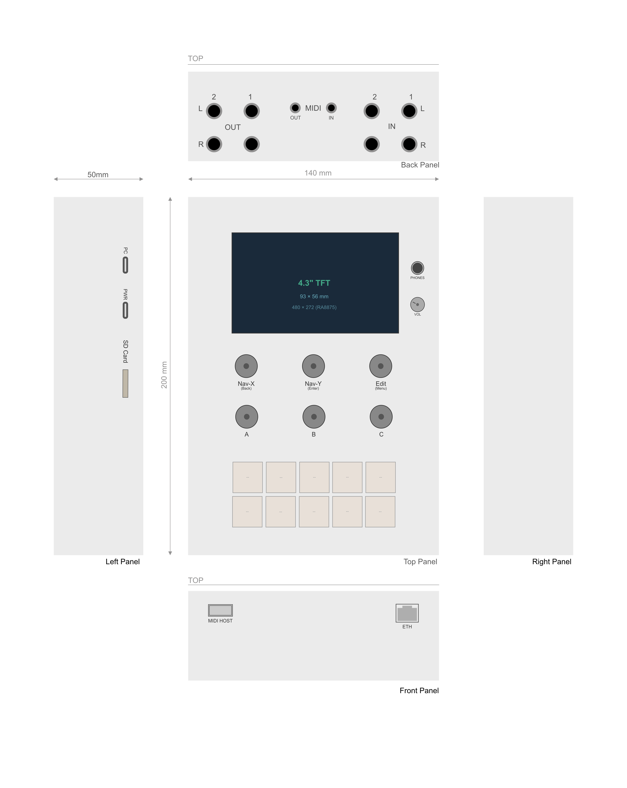

# SYNTEE

**Open-source DSP module for synths, effects, samplers, and more.**

Built around the Teensy 4.1, SynTee is a compact desktop DSP module designed for electronic musicians, synth enthusiasts, and DIY audio builders. A base firmware layer exposes the hardware — codec, MIDI, network audio, controls — while a swappable functional layer on top defines the device's role: synthesizer, effects processor, sampler, or anything else that fits the I/O. The primary function is a MIDI-controlled synthesizer, but the platform is open to any DSP workload.




## Features

- **2× stereo audio output** via AK4619VN codec (48 kHz / 24-bit, I2S, 3.5mm jacks)
- **2× stereo audio input** for external processing / effects return (3.5mm jacks)
- **Headphone output** with dedicated MAX97220 amp and analog volume knob
- **4.3" touchscreen** (800×480, [DESPEE](https://github.com/openaudiotools/despee) module — ESP32-S3 + LVGL) for patch editing and visualization
- **12 LED-backlit pads** (2×6 grid) for triggering, sequencing, and performance
- **3 rotary encoders** (Nav-X, Nav-Y, Edit) + **3 buttons** (A, B, C)
- **MIDI input** via USB host + 3.5mm TRS Type A + network MIDI 2.0
- **AES67 network audio** TX + RX (stereo out to DAW / mixer; stereo in from network)
- **USB Audio capable** (PC USB-C is USB 2.0 HS — reserved for future USB Audio Class 2 support)
- **mDNS/DNS-SD discovery** — auto-announces as `synth-XXXX.local`
- **Panel-accessible SD card** for preset storage, samples, and firmware updates
- **Modular hardware** — main board (4-layer PCB, Teensy + codec + controls), rear jack board (two rows of back-panel connectors), and external [DESPEE](https://github.com/openaudiotools/despee) display module; USB 5V power

## Architecture

SynTee uses a single AK4619VN codec (all 4 channels) on an I2S bus, driven by the Teensy 4.1's Cortex-M7 at 600 MHz. The base firmware exposes audio I/O, MIDI, network, and controls; a functional layer runs on top to define device behavior. In synth mode (the default), MIDI input drives a software synthesizer engine built on the PJRC Audio Library. Audio is routed to dual stereo DAC outputs and simultaneously packetized as AES67 RTP for network streaming. A stereo AES67 RX stream can also be received from the network and mixed into the audio router. Two stereo inputs allow external audio processing and effects returns. Power is supplied via a dedicated USB-C 5V input.

The diagram below shows the signal flow in synth mode:

```
                                               ┌──→ AK4619VN DAC1 ──→ OUT 1 L/R
MIDI IN ──┐                                    │
           ├──→ DSP Engine (Teensy 4.1)   ──→──┼──→ AK4619VN DAC2 ──→ OUT 2 L/R
Network ──┘         ▲                          │
                    │                          ├──→ MAX97220 ──→ Headphones
AK4619VN ADC1 ◄── IN 1 L/R                    │
AK4619VN ADC2 ◄── IN 2 L/R                    ├──→ AES67 TX ──→ Ethernet
                                               │
AES67 RX ◄── Ethernet ──────────────────────── ┘
```

## Repository Structure

```
syntee/
├── README.md              ← you are here
├── LICENSE                ← MIT (firmware) + CERN-OHL-P v2 (hardware) + CC BY 4.0 (docs)
├── docs/                  ← system-level design specifications
│   ├── hardware.md        ← key ICs, power budget, target audio specs
│   ├── pin-mapping.md     ← Teensy 4.1 pin assignments for SynTee
│   ├── firmware.md        ← audio pipeline, synth engine, network stack
│   ├── pcb-design-rules.md ← trace widths, clearances, manufacturing rules
│   ├── network-connectivity.md ← AES67 streaming, mDNS discovery, PTP sync
│   └── journal/           ← development journal
├── hardware/              ← schematics, PCB, mechanical
│   ├── lib/               ← shared KiCad footprint library
│   │   └── syntee-footprints.pretty/
│   └── pcbs/
│       └── main/              ← main board (4-layer)
│           ├── README.md      ← board concept, dimensions, key ICs
│           ├── connections.md ← connector pinouts
│           ├── architecture.md ← circuit details
│           ├── CLAUDE.md      ← agent guidance
│           └── designs/       ← KiCad files + gerbers
├── firmware/              ← Teensy 4.1 firmware (PlatformIO)
│   ├── platformio.ini
│   ├── src/main.cpp
│   └── lib/               ← project-local libraries
└── LICENSE
```

## Status

**Pre-prototype / Design phase.** Hardware and firmware specifications are being defined. This repository was just initialized.

## License

SYNTEE is fully open source. Hardware is licensed under CERN-OHL-P v2 (permissive), firmware under MIT, and documentation under CC BY 4.0. See [LICENSE](LICENSE) for details.

**Author:** Juliusz Fedyk — [openaudiotools.com](https://openaudiotools.com)
